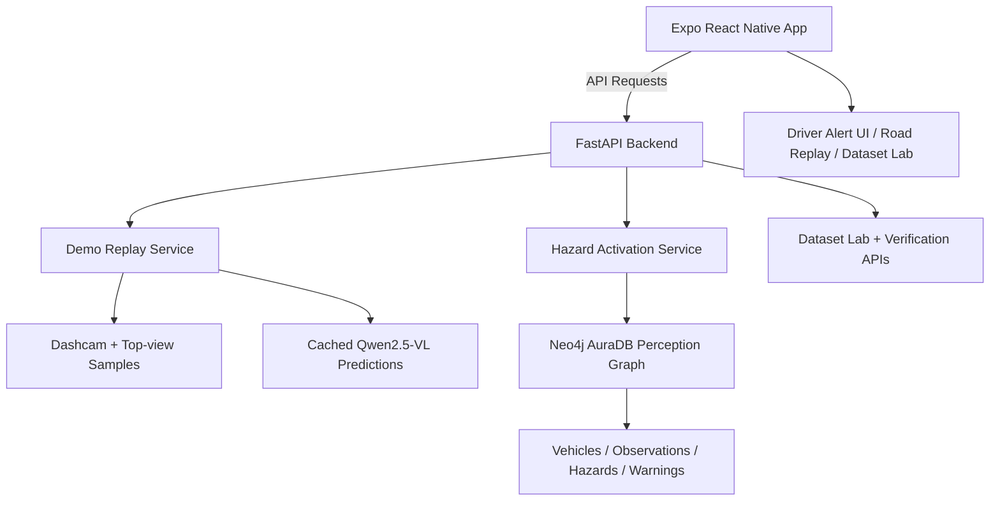

# 🚘 Sentinel

> **Cooperative Perception for Autonomous Vehicles on Indian Roads**  
> A multimodal road hazard intelligence system that combines dashcam vision, top-view map context, VLM reasoning, and graph-based provenance to warn vehicles about hidden hazards before they become directly visible.

---

## 📌 Problem & Domain

Autonomous driving is difficult on Indian roads because the environment is rarely clean or predictable. Vehicles deal with mixed traffic, unclear lane discipline, irregular junctions, temporary obstacles, blind spots, potholes, and hazards that may appear too late for a single vehicle to react safely.

Most perception systems focus on what one vehicle can see at one moment. Sentinel explores a different layer: **cooperative road intelligence**. If one observer vehicle has already detected or understood a hazard, an approaching vehicle should be warned before it reaches the same danger zone.

**Themes Selected:**
- [ ] Human Experience & Productivity  
- [ ] Climate & Sustainability Systems  
- [ ] HealthTech & Bio Platforms  
- [ ] Learning & Knowledge Systems  
- [ ] Work, Finance & Digital Economy  
- [x] **Infrastructure, Mobility & Smart Systems**  
- [ ] Trust, Identity & Security  
- [ ] Media, Social & Interactive Platforms  
- [ ] Public Systems, Governance and Civic Tech  
- [ ] Developer Tools & Software Infrastructure  

---

## 🎯 Objective

Sentinel aims to make autonomous and driver-assist systems more context-aware on complex Indian roads.

### Target Users
- Autonomous vehicle research teams
- Driver-assist system developers
- Intelligent transportation and smart mobility platforms
- Road safety monitoring systems
- Dataset and VLM evaluation researchers

### Pain Point
Traditional object detection can identify entities such as cars, bikes, trucks, or pedestrians, but it does not fully answer higher-level driving questions:

- Is this road segment a junction or an arterial road?
- Is the traffic density increasing?
- Is the road layout complex?
- Is there a hazard beyond the current line of sight?
- Should the vehicle slow down, yield, prepare to stop, or increase attention?

### Value Provided
Sentinel uses multimodal perception and graph verification to demonstrate how road hazards can be observed, persisted, verified, and shared across vehicles. The system turns isolated vehicle observations into a cooperative warning layer.

---

## 🧠 Team & Approach

### Team Name
`Sentinel`

### Team Members
- **Naman** — Full-stack development, Expo mobile frontend, FastAPI backend integration, VLM replay pipeline, Neo4j AuraDB graph verification, demo workflow

> Add other team members here if applicable.

### Our Approach

Sentinel was built around one core idea: **a vehicle cannot react to what it cannot yet see**.

To explore this, we designed a working hackathon prototype with four connected layers:

1. **Mobile warning interface** — a driver-facing Expo app for hazard alerts and replay visualization.
2. **Backend intelligence layer** — a FastAPI/Python service that serves replay samples, predictions, warnings, and graph verification.
3. **Multimodal VLM reasoning** — paired dashcam + top-view map context processed through cached genuine Qwen2.5-VL outputs.
4. **Graph provenance layer** — Neo4j AuraDB stores the relationship between vehicles, observations, hazards, warnings, and dispatch events.

The project intentionally includes a replay/evidence mode so that the demo is not only UI-driven. It shows model predictions, ground-truth comparisons, and graph persistence behind the warning shown to the driver.

---

## 🛠️ Tech Stack

### Core Technologies Used

- **Frontend:** Expo React Native, Expo Router, React Native, TypeScript
- **Backend:** Python, FastAPI, Uvicorn
- **Database / Graph:** Neo4j AuraDB, Neo4j Python Driver
- **Auxiliary Storage:** MongoDB / Motor for bounded telemetry and supporting state
- **AI / VLM:** Qwen2.5-VL cached prediction outputs for deterministic dataset replay
- **Data Context:** Paired dashcam images + top-view/map images
- **Hosting / Build:** Render backend deployment, EAS Build for Android preview builds
- **Mobile Capabilities:** Expo Location, Expo Speech, Expo Haptics, Expo Camera-ready structure

### Additional Technologies Used

- [x] AI / ML  
- [ ] Web3 / Blockchain  
- [ ] Cyber Security  
- [x] Cloud  

---

## 🏆 Sponsored Track

- [x] **Expo Track** — Built using Expo  
- [x] **Neo4j Track** — Uses AuraDB for graph-based hazard provenance  
- [ ] **Base44 Track** — Not used  

### How Sentinel uses Expo

Sentinel uses **Expo React Native** as the complete mobile frontend layer. The app was built as a driver-facing interface for cooperative road hazard intelligence.

Expo powers the main mobile screens:

- **Drive View / Ghost Vision**
- **Two-vehicle demo controls**
- **Hidden hazard alerts**
- **Sentinel Road Replay**
- **Research Provenance & Evidence**
- **Dataset Lab**

The app communicates with the FastAPI backend through `EXPO_PUBLIC_BACKEND_URL` to fetch replay samples, cached Qwen2.5-VL predictions, hazard warning data, and Neo4j graph verification status.

In the driver view, the approaching vehicle queries the shared hazard layer and receives a hidden hazard warning with distance, confidence, source vehicle count, and a recommended action such as **slow down**.

Expo and EAS Build helped turn Sentinel into a real mobile demo instead of only a web dashboard.

### How Sentinel uses Neo4j AuraDB

Sentinel uses **Neo4j AuraDB** as the graph verification and provenance layer for cooperative perception.

The graph models the real-world relationships between:

- `Vehicle`
- `Observation`
- `Hazard`
- `Warning`
- Road and replay context

When an observer vehicle detects or reports a hazard, Sentinel creates or verifies the relevant hazard and observation nodes. The observation is connected to the hazard through a provenance relationship, and the generated warning is connected to the approaching vehicle.

This allows the system to represent the full cooperative flow:

```text
Observer Vehicle → Observation → Hazard → Warning → Approaching Vehicle
```

In the app demo, Sentinel verifies that:

- the hazard node exists,
- the observation node exists,
- the provenance relationship is present,
- the warning dispatch has been recorded,
- graph-level metadata such as node count, edge count, warning count, and relationship types is available.

AuraDB makes the warning credible because the alert shown in the mobile app is backed by graph state, not just a static UI card.

---

## ✨ Key Features

- ✅ **Cooperative Perception Flow** — one vehicle observes a hazard and another approaching vehicle receives an early warning.
- ✅ **Hidden Hazard Warning** — alerts can be shown before the danger is directly visible to the approaching vehicle.
- ✅ **Dashcam + Map Multimodal Reasoning** — paired street-view and top-view context support richer road-scene understanding.
- ✅ **Cached Genuine Qwen2.5-VL Replay** — deterministic replay mode uses previously generated VLM prediction outputs.
- ✅ **Ground Truth vs Prediction Comparison** — compares Qwen outputs against expected labels for road type, traffic density, complexity, hazard presence, risk, and recommended action.
- ✅ **Neo4j Graph Verification** — verifies hazard, observation, warning, and provenance relationships.
- ✅ **Dataset Lab Workflow** — supports sample review, verification, correction, rejection, and export-oriented workflow.
- ✅ **Voice + Haptic Alerts** — Expo Speech and Haptics support driver-facing warning feedback.

---

## 🧩 System Architecture



### Architecture Summary

1. The Expo app requests current replay state or live/demo hazard state.
2. The FastAPI backend serves replay samples and prediction results.
3. Cached Qwen2.5-VL outputs provide structured road-scene labels.
4. Hazard-positive samples activate the cooperative warning pipeline.
5. Neo4j AuraDB persists and verifies hazard provenance.
6. The mobile UI displays warnings, graph verification, and dataset evidence.

---

## 🧪 VLM Replay Labels

Sentinel focuses on structured road-scene intelligence rather than only object detection.

The replay pipeline works with labels such as:

- `road_type`
- `traffic_density`
- `road_complexity`
- `hazard_presence`
- `anticipated_risk`
- `recommended_action`

Example recommended actions include:

- `slow_down`
- `maintain_speed`
- `increase_attention`
- `yield`
- `prepare_to_stop`
- `change_lane`

This makes the system more useful for autonomous-driving research because the model is asked to reason about scene context and driving response, not only detect objects.

---

## 📽️ Demo & Deliverables

- **Demo Video Link:** _Add YouTube / demo video link here_  
- **Deployment Link:** _Add Render backend / live app link here_  
- **Expo / EAS Build Link:** _Add APK or EAS build link here_  
- **Pitch Deck / PPT:** _Add presentation link here_  
- **Repository:** https://github.com/Gauth777/Sentinel

---

## ✅ Tasks & Bonus Checklist

- [ ] All team members completed the mandatory social task  
- [ ] Bonus Task 1 – Badge sharing  
- [ ] Bonus Task 2 – Blog/article  

---

## 🧪 How to Run the Project

### Requirements

- Node.js / npm or yarn
- Python 3.10+
- Expo CLI / EAS CLI
- Neo4j AuraDB instance
- MongoDB instance if using telemetry-backed local state
- Backend environment variables configured through `.env`

---

### Backend Setup

```bash
cd backend
pip install -r requirements.txt
python -m uvicorn server:app --host 0.0.0.0 --port 8000
```

Health check:

```bash
http://localhost:8000/api/health
```

---

### Frontend Setup

```bash
cd frontend
npm install
npm run start
```

For Android preview:

```bash
cd frontend
npx eas build --platform android --profile preview
```

---

### Environment Variables

Backend variables are documented in `backend/.env.example`. Important variables include:

```env
PORT=8000
MONGO_URL=mongodb://localhost:27017
DB_NAME=test_database
NEO4J_ENABLED=true
SENTINEL_NEO4J_STRICT=true
NEO4J_URI=neo4j+s://your-aura-instance.databases.neo4j.io
NEO4J_USERNAME=neo4j
NEO4J_PASSWORD=your-password
NEO4J_DATABASE=neo4j
SENTINEL_DEMO_SCENARIO_DIR=backend/demo_scenarios
SENTINEL_QWEN_ENABLED=false
SENTINEL_QWEN_MODEL=Qwen2.5-VL-7B-Instruct
```

Frontend variables:

```env
EXPO_PUBLIC_BACKEND_URL=https://your-backend-api.com
```

Do not commit API keys, database passwords, or private dataset paths.

---

## 🗂️ Demo Scenario Structure

Curated replay scenarios are expected in the following structure:

```text
backend/demo_scenarios/
  manifest.json
  sample_001/
    dashcam.jpg
    topview.png
    cached_prediction.json
  sample_002/
    dashcam.jpg
    topview.png
    cached_prediction.json
  ...
```

Each sample pairs street-level dashcam evidence with a top-view/map context image and a cached prediction response.

---

## 🔬 Truthful Demo Claims

Sentinel is a research and demonstration prototype, not a production autonomous-driving system.

To keep the project scientifically accurate:

- Replayed images are synchronized dashcam and top-view research/demo samples.
- Cached Qwen predictions are pre-computed outputs used for deterministic replay.
- Sentinel does not train Qwen from scratch.
- The VLM does not continuously learn during the demo.
- The project demonstrates a cooperative perception layer, not a complete autonomous driving stack.
- Private credentials, full research datasets, and secrets are not committed to the repository.

---

## 🧬 Future Scope

- 📈 Expand from 5 replay samples to a larger Indian-road benchmark dataset.
- 🚗 Integrate real-time multi-vehicle telemetry and V2V/V2X communication.
- 🧠 Add live VLM inference mode with latency and confidence monitoring.
- 🗺️ Improve map-matching and geospatial hazard localization.
- 🔒 Add stronger trust, verification, and abuse prevention for shared hazard reports.
- 📊 Build analytics for model errors, false positives, and replay-based evaluation.
- 🌐 Support more Indian languages for driver alerts.

---

## 📎 Resources / Credits

- Expo React Native ecosystem
- FastAPI and Python backend stack
- Neo4j AuraDB graph database
- Qwen2.5-VL for vision-language reasoning
- Paired dashcam + top-view/map road-scene samples
- HackHazards'26 organizer template and submission structure

---

## 🏁 Final Words

Sentinel was built to explore a simple but important question:

> What if vehicles did not have to discover every road hazard alone?

By combining dashcam vision, map context, VLM reasoning, and graph-backed provenance, Sentinel demonstrates how autonomous systems can move from isolated object detection toward shared road-scene understanding.

The final goal is not just vehicles that see better — it is vehicles that understand earlier.

---
