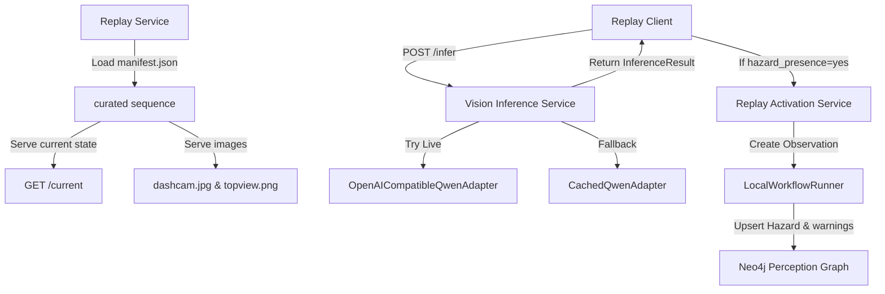

# Sentinel: Indian Road Scenario Replay & Qwen Perception Engine

Sentinel is a cooperative tactical road safety application. This documentation describes the **Indian Road Scenario Replay** mode, the **Qwen Multimodal VLM Structured Inference** integration, and the authoritative cooperative hazard perception pipeline.

---

## 1. Merged System Architecture

The Sentinel backend uses a hybrid storage model where the perception provenance graph acts as the single source of truth for core safety entities.

### Authoritative Graph Storage (Neo4j / PerceptionGraph)
- **Hazards & Observations**: Creation, matching, spatial lookup, and state resolution of hazards are fully graph-authoritative.
- **Warnings & Trigger Chains**: `Warning` nodes and their associated `TRIGGERED_WARNING` and `DELIVERED_TO` relationships are persisted only in the graph.
- **Community Feedback**: Voter `Vehicle` nodes and their corresponding `CONFIRMED` and `REPORTED_INCORRECT` relationships are recorded graph-authoritatively. Monotonicity checks prevent active/resolved status regressions.

### Bounded Document Storage (MongoDB)
- **Nearby Vehicle Telemetry**: Active vehicle GPS positions and telemetry updates remain backed by MongoDB to support rapid real-time lookup.
- **Auxiliary States**: Media storage references and static application configs.



- **Independent State**: Maintains current sequence index independently of database contents.
- **Security Boundaries**: Filesystem paths, expected research labels, and cached prediction files are strictly isolated from client-facing routes. Path traversal and absolute paths are validated and rejected.

---

## 2. Directory Layout & Production Setup

Curated replay scenario data is stored under:
```
backend/demo_scenarios/
  manifest.json              # Curated samples definition
  README.md                  # Schema description and documentation
  sample_001/
    dashcam.jpg              # Dashcam perspective image
    topview.png              # Top-down road context image
    cached_prediction.json   # Pre-calculated Qwen response
  sample_002/
    ...
```

To run with production replay assets:
1. Create a `manifest.json` under `backend/demo_scenarios/` (or copy and modify `manifest.example.json`).
2. Populate `sample_001/` to `sample_005/` with your matched `dashcam.jpg` and `topview.png` pairs.
3. Configure `cached_prediction.json` for each sample to enable deterministic fallbacks.

---

## 3. Environment Setup & Configuration

Configure the backend using the environment variables documented in `backend/.env.example`. Create a local copy as `backend/.env`:

| Key | Description | Recommended Deployed Default |
|---|---|---|
| `PORT` | API port | `8000` |
| `MONGO_URL` | MongoDB connection URL | `mongodb://localhost:27017` |
| `DB_NAME` | MongoDB database name | `test_database` |
| `NEO4J_ENABLED` | Toggle Neo4j integration | `true` |
| `SENTINEL_NEO4J_STRICT` | Raise errors on Neo4j failure | `true` |
| `NEO4J_URI` | Neo4j endpoint | `bolt://localhost:7687` |
| `NEO4J_USERNAME` | Neo4j login user | `neo4j` |
| `NEO4J_PASSWORD` | Neo4j login password | — |
| `NEO4J_DATABASE` | Neo4j default database | `neo4j` |
| `CORS_ORIGINS` | Comma-separated allowed CORS origins | — (defaults to wildcard "*") |
| `SENTINEL_DEMO_SCENARIO_DIR` | Directory containing manifest.json | `backend/demo_scenarios` |
| `SENTINEL_QWEN_ENABLED` | Attempt live VLM requests | `false` (unless real API configured) |
| `SENTINEL_QWEN_BASE_URL` | OpenAI-compatible endpoint URL | — |
| `SENTINEL_QWEN_API_KEY` | VLM API key | — |
| `SENTINEL_QWEN_MODEL` | VLM model identifier | `Qwen2.5-VL-7B-Instruct` |

---

## 4. Operational Instructions & Running

### Starting Backend Locally
1. Initialize the virtual environment and install dependencies:
   ```bash
   cd backend
   pip install -r requirements.txt
   ```
2. Start the FastAPI server:
   ```bash
   .venv/Scripts/python -m uvicorn server:app --port 8000
   ```
3. Check status at `http://localhost:8000/api/health`.

### Starting Backend with Docker
1. Build the container from the repository root:
   ```bash
   docker build -t sentinel-backend ./backend
   ```
2. Run the container, supplying the required environment variables:
   ```bash
   docker run -d -p 8000:8000 --env-file ./backend/.env sentinel-backend
   ```

### Starting Frontend
1. Install node dependencies:
   ```bash
   cd frontend
   npm install
   ```
2. Configure `frontend/.env` based on `frontend/.env.example`:
   ```env
   EXPO_PUBLIC_BACKEND_URL=https://your-backend-api.com
   ```
3. Start Expo:
   ```bash
   npm run start
   ```

---

## 5. Deployed Backend & EAS Preview Workflow

To generate an installable Android preview build:
1. Ensure the `EXPO_PUBLIC_BACKEND_URL` is set in your Expo builder environment. Do not commit local URLs to source control.
2. Build the Android preview APK using EAS:
   ```bash
   cd frontend
   npx eas build --platform android --profile preview
   ```

---

## 6. Truthful Demo Claims

To ensure accurate and scientific representation of this work during evaluations:
- **Dataset Replay Badge**: The console prominently displays `DATASET REPLAY MODE` or `INDIAN ROAD SCENARIO REPLAY`.
- **Pre-recorded images**: Replayed images are synchronized dashcam and top-view research samples, not a live camera feed.
- **No Continuous Online Learning**: The VLM does not update or learn continuously in-context.
- **Model Training**: Sentinel does not train Qwen from scratch; it utilizes instruction-tuned models for structured reasoning.
- **Inference Badges**: Distinguish clearly between `LIVE QWEN` and `CACHED QWEN FALLBACK` responses in the console.
- **Cached Output Is Not Live Output**: Cached predictions are pre-calculated and validated offline. They do not represent live model responses.
- **Private Replay Assets**: A cloned public repository starts unconfigured. Real research images and cached prediction files are intentionally excluded from version control.
