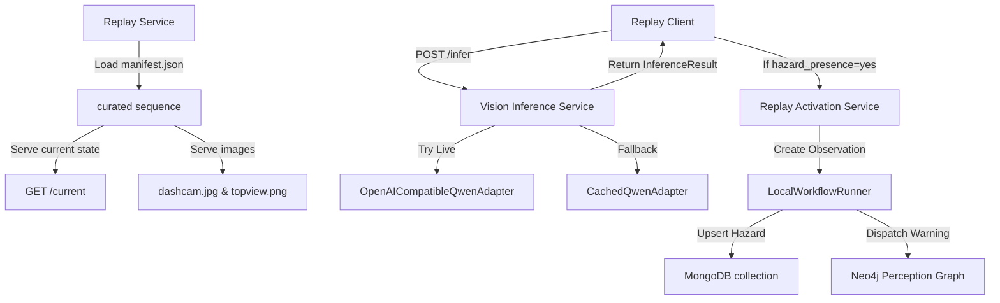

# Sentinel: Indian Road Scenario Replay & Qwen Perception Engine

Sentinel is a cooperative tactical road safety application. This documentation describes the **Indian Road Scenario Replay** mode, the **Qwen Multimodal VLM Structured Inference** integration, and cooperative hazard warning pipeline.

---

## 1. Dataset Replay Architecture

The Replay subsystem enables deterministic simulation of Indian road driving scenarios using synchronized dual-view (Dashcam and Top-view/Map context) research samples.



- **Independent State**: Maintains current sequence index independently of database contents.
- **Security Boundaries**: Filesystem paths, expected research labels, and cached prediction files are strictly isolated from client-facing routes. Path traversal and absolute paths are validated and rejected.

---

## 2. Directory Layout & Production Setup

 Curated replay scenario data is stored under:
```
backend/demo_scenarios/
  manifest.json              # Curated samples definition
  README.md                  # Schema description and documentation
  sample_001/
    dashcam.jpg              # Dashcam perspective image
    topview.png              # Top-down road context image
    cached_prediction.json   # Pre-calculated Qwen response
  sample_002/
    ...
```

To run with production replay assets:
1. Create a `manifest.json` under `backend/demo_scenarios/` (or copy and modify `manifest.example.json`).
2. Populate `sample_001/` to `sample_005/` with your matched `dashcam.jpg` and `topview.png` pairs.
3. Configure `cached_prediction.json` for each sample to enable deterministic fallbacks.

---

## 3. Qwen Structured Inference & Fallback Policy

### Environment Variables

Configure the VLM endpoint using the following environment variables in `backend/.env`:

| Key | Description | Default |
|---|---|---|
| `SENTINEL_DEMO_SCENARIO_DIR` | Directory containing manifest.json | `backend/demo_scenarios` |
| `SENTINEL_QWEN_ENABLED` | Set to `"true"` to attempt live VLM requests | `"false"` |
| `SENTINEL_QWEN_BASE_URL` | Base URL of the OpenAI-compatible endpoint | — |
| `SENTINEL_QWEN_API_KEY` | Bearer token for authorization | — |
| `SENTINEL_QWEN_MODEL` | VLM model identifier | `Qwen2.5-VL-7B-Instruct` |
| `SENTINEL_QWEN_TIMEOUT_SECONDS` | Timeout threshold for live requests | `30` |
| `SENTINEL_QWEN_PROMPT_VERSION` | Prompt version identifier | `v1` |

### Fallback Policy
1. **Live Inference**: If `SENTINEL_QWEN_ENABLED=true` and credentials are set, the engine converts local images to base64 Data URLs and runs temperature=0 inference against the configured OpenAI-compatible chat completion endpoint.
2. **Timeout & Error Handling**: If a request times out or receives malformed/unexpected JSON, the service logs the error and falls back to cached predictions.
3. **Cached Fallback**: The service checks for `cached_prediction.json` associated with the current sample, parses it, and validates it against the Pydantic schema.
4. **Failure State**: If neither live inference nor cached predictions succeed, a controlled `422 Unprocessable Content` response is returned. Ground-truth research labels are **never** used as an automatic fallback.

---

## 4. Hazard Activation & Graph Sync

When inference detects a hazard (`hazard_presence: "yes"`):
1. **Observation Mapping**: Creates a Sentinel observation with identifier `obs-replay-{sample_id}-{inference_id}`.
2. **Observer Vehicle**: Attributed to vehicle `v-replay-observer` ("Sentinel Dataset Observer").
3. **Workflow Runner**: Feeds the observation into `LocalWorkflowRunner` to create/update the active hazard.
4. **Deterministic Inference IDs**: Inference IDs are computed from the canonical prediction output (including `warningText`), not timestamps or random values.
5. **Idempotency**: Repeated activation requests for the same inference ID retrieve the stored result. Per-inference locking prevents concurrent duplicate workflow executions.
6. **Warning Semantics**: `warningTextGenerated` indicates multilingual warning strings were created. `warningEventCreated` indicates at least one warning was successfully persisted to the perception graph or Neo4j. These are independent booleans.
7. **Neo4j & Graph**: Records nodes in the perception provenance graph and links approaching vehicles.

---

## 5. API Endpoints

Replay routes are prefixed under `/api/sentinel/demo-replay`:

- `GET /api/sentinel/demo-replay` — Get service configuration and readiness status.
- `GET /api/sentinel/demo-replay/samples` — List safe metadata for all enabled samples.
- `GET /api/sentinel/demo-replay/current` — Fetch currently selected sample.
- `GET /api/sentinel/demo-replay/samples/{sample_id}` — Get single sample metadata.
- `GET /api/sentinel/demo-replay/samples/{sample_id}/dashcam` — Serve dashcam image.
- `GET /api/sentinel/demo-replay/samples/{sample_id}/topview` — Serve top-view map.
- `POST /api/sentinel/demo-replay/advance` — Move pointer to next enabled sample (loops back).
- `POST /api/sentinel/demo-replay/reset` — Reset pointer to first sample.
- `POST /api/sentinel/demo-replay/reload` — Re-read manifest.json and refresh sample list without server restart.
- `POST /api/sentinel/demo-replay/samples/{sample_id}/infer` — Run structured VLM inference. Optional body parameter: `{"activate": true}` (default: true).

---

## 6. Truthful Demo Claims

To ensure accurate and scientific representation of this work during evaluations:
- **Dataset Replay Badge**: The console must prominently display `DATASET REPLAY MODE` or `INDIAN ROAD SCENARIO REPLAY`.
- **Pre-recorded images**: Replayed images are synchronized dashcam and top-view research samples, not a live camera feed.
- **No Continuous Online Learning**: The VLM does not update or learn continuously in-context.
- **Model Training**: Sentinel does not train Qwen from scratch; it utilizes instruction-tuned models for structured reasoning.
- **Inference Badges**: Distinguish clearly between `LIVE QWEN` and `CACHED QWEN FALLBACK` responses in the console.
- **Cached Output Is Not Live Output**: Cached predictions are pre-calculated and validated offline. They do not represent live model responses.
- **Private Replay Assets**: A cloned public repository starts unconfigured. Real research images and cached prediction files are intentionally excluded from version control.

---

## 7. Run Instructions

### Start Backend
1. Initialize virtual environment and start FastAPI server:
   ```bash
   cd backend
   .venv/Scripts/python -m uvicorn server:app --reload --port 8000
   ```
2. Check readiness at `http://localhost:8000/api/sentinel/demo-replay`.

### Start Frontend
1. Start the Expo developer server:
   ```bash
   cd frontend
   npm run start
   ```
2. Navigate to `INDIAN ROAD REPLAY` from the main Ghost Vision control panel.
